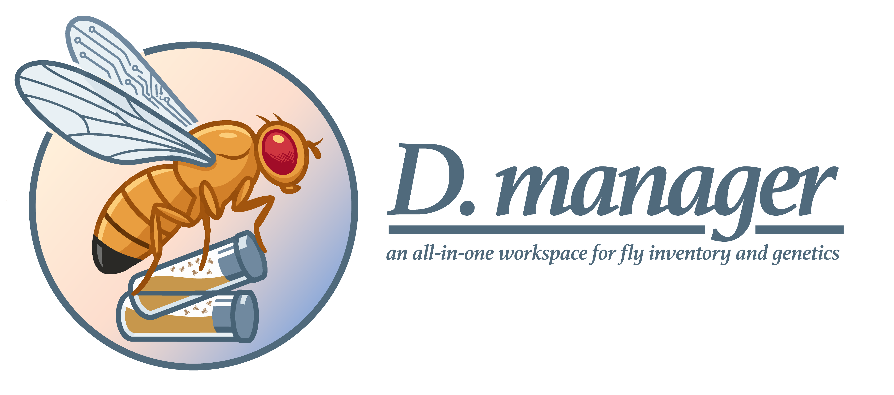

# D. manager



A focused stock-management workspace for Drosophila labs, built with Flask, MongoDB, and an operations-first deployment model.

[](https://github.com/neurorishika/FlyManager/actions/workflows/docs.yml)
[](https://neurorishika.github.io/FlyManager/)
[](https://www.python.org/)
[](https://flask.palletsprojects.com/)
[](https://www.mongodb.com/)
[](LICENSE)

D. manager is the public-facing product identity for the FlyManager codebase. It gives research labs a single place to manage stocks, crosses, trays, flip schedules, labels, and reminder workflows with a browser-based interface and a production-ready deployment path.

## Documentation

- Product site: [https://neurorishika.github.io/FlyManager/](https://neurorishika.github.io/FlyManager/)
- User guide: [https://neurorishika.github.io/FlyManager/user-guide/](https://neurorishika.github.io/FlyManager/user-guide/)
- Deployment guide: [DEPLOYMENT.md](DEPLOYMENT.md)
- Platform runbooks: [PLATFORM_DEPLOYMENT.md](PLATFORM_DEPLOYMENT.md)
- Backup and recovery: [BACKUP_AND_RECOVERY.md](BACKUP_AND_RECOVERY.md)

## What It Covers

- Stock, cross, and tray workflows in one Flask application.
- Flip scheduling, reminders, and printable label generation.
- MongoDB-backed persistence with container-friendly deployment defaults.
- Production HTTPS deployment with Caddy and GitHub Pages-hosted documentation.
- An operator-facing user guide for first-run setup, daily use, and launch readiness.

## Quick Start

The fastest path on a fresh machine uses the included install script.

```bash
git clone https://github.com/neurorishika/FlyManager.git
cd FlyManager
./scripts/install.sh
```

That bootstrap path will:

- create required runtime directories
- create `.env` from `.env.example` if needed
- generate a `SECRET_KEY` automatically
- build and start the app and MongoDB containers

Open `http://localhost:5234` once the services are healthy.

## Local Development

For local non-Docker development:

```bash
poetry install
cp .env.example .env
poetry run python flymanager/app/run.py
```

For docs development:

```bash
python3 -m pip install -r requirements-docs.txt
mkdocs serve
```

## Deployment Paths

### Docker Compose

```bash
cp .env.example .env
docker compose up -d --build
```

Key environment values in `.env`:

- `SECRET_KEY` for session stability
- `MONGO_URI` and `MONGO_DB_NAME` for database configuration
- `SMTP_*` for reminder email delivery
- `FLYMANAGER_ADMIN_*` for optional bootstrap account creation

### Production HTTPS

```bash
cp .env.example .env
./scripts/install-production.sh flymanager.example.com
```

This adds a Caddy reverse proxy, automatic TLS, and domain-based routing on top of the base app stack.

## Operations

MongoDB backup:

```bash
./scripts/mongo-backup.sh
```

MongoDB restore:

```bash
./scripts/mongo-restore.sh backups/mongodb/flymanager_mongodb_YYYYMMDD_HHMMSS.archive.gz
```

State backup:

```bash
./scripts/state-backup.sh
```

Health endpoints:

- `/health`
- `/health/ready`

## Project Notes

- The repository name remains FlyManager for package, code, and GitHub contexts.
- The user-facing brand is D. manager.
- The scheduler is intended for a single active app instance unless its coordination model changes.
- Generated labels persist under `flymanager/app/static/generated_labels`, while runtime data persists under `data/`.

## License

This project is licensed under the BSD 3-Clause License. See [LICENSE](LICENSE).
